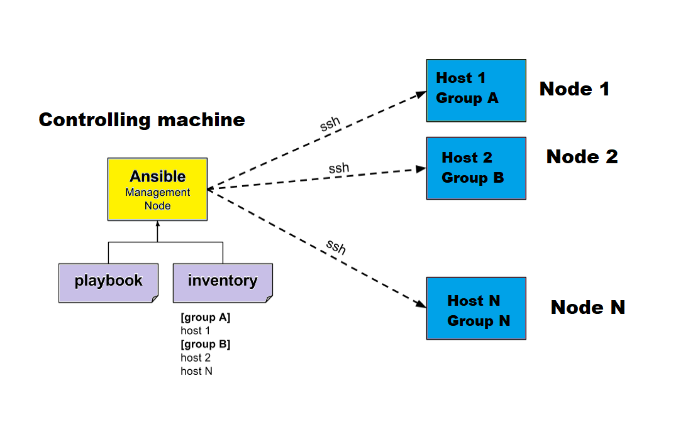
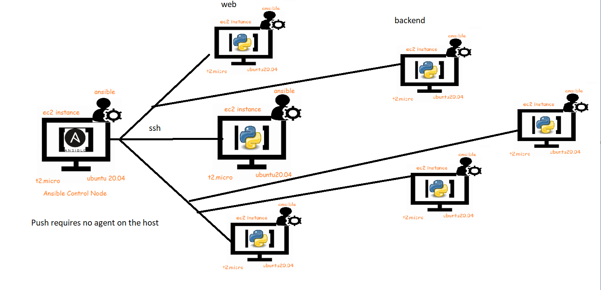

# Ansible 
* Ansible is simple open source IT engine which automates application deployment, intra service orchestration, cloud provisioning and many other IT tools
* Ansible is easy to deploy because it does not use any agents or custom security infrastructure.

* Ansible uses playbook to describe automation jobs, and playbook uses very simple language i.e. YAML (It’s a human-readable data serialization language & is commonly used for configuration files, but could be used in many applications where data is being stored)which is very easy for humans to understand, read and write. Hence the advantage is that even the IT infrastructure support guys can read and understand the playbook and debug if needed (YAML – It is in human readable form).

* is designed for multi-tier deployment. Ansible does not manage one system at time, it models IT infrastructure by describing all of your systems are interrelated. Ansible is completely agentless which means Ansible works by connecting your nodes through ssh(by default). But if you want other method for connection like Kerberos, Ansible gives that option to you.

* After connecting to your nodes, Ansible pushes small programs called as “Ansible Modules”. Ansible runs that modules on your nodes and removes them when finished. Ansible manages your inventory in simple text files (These are the hosts file). Ansible uses the hosts file where one can group the hosts and can control the actions on a specific group in the playbooks.

## Environment Setup


## Server & Node configuration 



## Ansible Server: 
It is a machine where Ansible is installed and from which all tasks and playbooks will be executed.
## Modules: 
The module is a command or set of similar commands which is executed on the client-side.
## Task: 
A task is a section which consists of a single procedure to be completed.
## Role: 
It is a way of organizing tasks and related files to be later called in a playbook.
## Fact: 
The information fetched from the client system from the global variables with the gather facts operation.
## Inventory: 
A file containing the data regarding the Ansible client-server.
## Play: 
It is the execution of the playbook.
## Handler: 
The task is called only if a notifier is present.
## Notifier: 
The section attributed to a task which calls a handler if the output is changed.
## Tag: 
It is a name set to a task that can be used later on to issue just that specific task or group of jobs.


## Shell script install Ansible :
```bash
#!/bin/bash

if ! command -v ansible >/dev/null; then
* echo "Installing Ansible dependencies and Git."
* if command -v yum >/dev/null; then
* sudo yum install -y git python python-devel
* elif command -v apt-get >/dev/null; then
* sudo apt-get update -qq
* #sudo apt-get install -y -qq git python-yaml python-paramiko python-jinja2
* sudo apt-get install -y -qq git python python-dev
* else
* echo "neither yum nor apt-get found!"
* exit 1
* fi
* echo "Installing pip via easy_install."
* wget http://peak.telecommunity.com/dist/ez_setup.py
* sudo python ez_setup.py && rm -f ez_setup.py
* sudo easy_install pip
* # Make sure setuptools are installed crrectly.
* sudo pip install setuptools --no-use-wheel --upgrade
* echo "Installing required python modules."
* sudo pip install paramiko pyyaml jinja2 markupsafe
* sudo pip install ansible
fi
```
## Node Requirments 


# Concepts  Ansible 

## Control node
* Any machine with Ansible installed. You can run Ansible commands and playbooks by invoking the ansible or ansible-playbook command from any control node. You can use any computer that has a Python installation as a control node - laptops, shared desktops, and servers can all run Ansible. However, you cannot use a Windows machine as a control node. You can have multiple control nodes.

## Managed nodes
* The network devices (and/or servers) you manage with Ansible. Managed nodes are also sometimes called “hosts”. Ansible is not installed on managed nodes.

## Inventory
* A list of managed nodes. An inventory file is also sometimes called a “hostfile”. Your inventory can specify information like IP address for each managed node. An inventory can also organize managed nodes, creating and nesting groups for easier scaling. To learn more about inventory, see the Working with Inventory section.

## Collections
* Collections are a distribution format for Ansible content that can include playbooks, roles, modules, and plugins. You can install and use collections through Ansible Galaxy. To learn more about collections, see Using collections.

## Modules
* The units of code Ansible executes. Each module has a particular use, from administering users on a specific type of database to managing VLAN interfaces on a specific type of network device. You can invoke a single module with a task, or invoke several different modules in a playbook. Starting in Ansible 2.10, modules are grouped in collections. For an idea of how many collections Ansible includes, take a look at the Collection Index.

## Tasks
* The units of action in Ansible. You can execute a single task once with an ad hoc command.

## Playbooks

* Ordered lists of tasks, saved so you can run those tasks in that order repeatedly. Playbooks can include variables as well as tasks. Playbooks are written in YAML and are easy to read, write, share and understand. To learn more about playbooks, see Intro to playbooks.


## While running the playbooks we can see more logs of whats happening when the playbook executes  
* Ansible: Enable Debug and Increase Verbosity

### verbosity=[0|1|2|3|4] : ```Set the default verbosity level```
 * ANSIBLE_DEBUG=true -vvvv ansible-playbook playbook.yml

### debug=[false|true]: 	```Enable the debug output```
*  ANSIBLE_DEBUG=true ANSIBLE_VERBOSITY=4 ansible-playbook playbook.yml

## Ansible configurations are store in the directory /etc/ansible in the file ansible.cfg
### ansible.cfg :
* The behavior of ansible like default inventory, module search path & many more are picked up from ansible configuration file at /etc/ansible/ansible.cfg
* 
### hosts :
* The hosts file in /etc/ansible is the default inventory file.
* While running playbook’s if you dont provide any inventory then this default inventory is picked up

# Adhoc Command
* From ansible we can run modules, This module is expressed as yaml and we use it tasks or handler section which leads to playbook      Ansible modules can be executed directly as command line which is referred as adhoc command

``` ansible -m <name of module> -a <arguments>```
* Ping Module 
``` ansible -i inventory -m ping all```

* adhoc command for normal command  "sudo apt update && sudo apt install git -y"
``` ansible -b -m 'apt' -a 'name=git update_cache=yes state=present' all ```


## [playbook](./playbook.md) Click Here:

## [Ansible Modules](./Ansible_modules.md)

##  [Inventory in Ansible](./Inventory.md)

## [Ansible_Roles](./Ansible_Roles.md)
